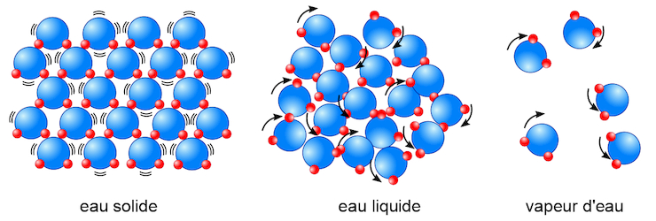

---
---
Dans ce petit article, nous allons aborder une notion importante de la théorie de l'information. Si cette théorie vous est étrangère, on peut grossièrement la résumer
(et c'est largement suffisant) en un domaine qui étudie le contenu d'une information, comment le transmettre efficacement, secrètement, ou bien comment le décoder, l'interpréter.

### Petit préambule de formalisme

En théorie de l'information, on modélise nos messages reçus par des variables aléatoires. Imaginons que je vous envoie successivement des lettres de l'alphabet.

On note par coutume du domaine $$\chi$$ ("chi" prononcé "ki") l'alphabet, l'ensemble des messages. Dans notre cas, le mot est bien choisi, il s'agit de l'alphabet latin.
Sans vous choquer, je pense affirmer :
$$|\chi| = 26$$

Si je distibuais aléatoirement mes lettres, on utiliserait pour formaliser une loi uniforme sur $$\llbracket1,26\rrbracket$$.
Du côté récepteur, on s'attend à recevoir un "e" une fois sur 26.

On pourrait aussi respecter les [fréquences "usuelles"](https://fr.wikipedia.org/wiki/Fr%C3%A9quence_d%27apparition_des_lettres#Base_statistique_de_calcul_:_la_hit_clair) des lettres. On observe davantage de "e" que de "z" en français par exemple.

#### Petit rappel de la loi de Bernoulli

C'est l'occasion de rappeler une loi simple et fondamentale, la loi de Bernoulli. On attribue à un évènement la qualité de "succès", l'évènement complémentaire est alors un "échec".
Par exemple, dans un lancer de pièce, on peut dire que faire face est un "succès" et faire pile devient un "échec".

On peut attribuer une probabilité $$p$$ à notre succès. La loi de Bernoulli renvoie simplement 1 quand le succès est réalisé, 0 sinon.

$$X({\text{succès}}) = 1 \text{     }\text{     } X({\text{échec}}) = 0$$

Dans le cadre de la théorie de l'information, elle sert à modéliser des envoies de codes binaires (succession de 1 et de 0) ou encore la question "ai-je reçu... ?".
Par exemple, je vous envoie des lettres de manière uniforme. Vous vous demandez "Est-ce que je reçois un "a" ?". Le succès est de recevoir le "a".

$$P(X = 1) = \dfrac{1}{26} \text{     }\text{      et     } P(X = 0) = \dfrac{25}{26}$$

On remarque alors que la modélisation probabiliste dépend autant de l'envoi que de la réception. En général, l'un est fixé.

### Entropie d'information

#### Histoire et intuition

La notion d'entropie n'est pas totalement obscure à l'élève de classe prépa tant elle est fondamentale en thermodynamique. Une première approche de l'entropie est de dire qu'elle est une fonction croissante du désordre.
Cela vaut aussi physiquement. L'entropie d'un gaz est supérieure à l'entropie d'un solide, le premier est désordonné et le second est ordonné.

.

L'entropie d'information est sensiblement semblable. En fait, si on faisait les mathématiques derrière la thermodynamique, on pourrait montrer que plus ou moins la même notion à un facteur près.

C'est Claude Shannon (le même du théorème sur l'échantillonnage) qui a le premier défini cette notion en mathématiques. Supposons pour simplifier un peu notre formalisation que l'on possède cette fonction d'entropie H, qui prend en argument des variables aléatoires (qui modélisent nos informations). H sera d'autant plus grand que l'information sera surprenante et chaotique.

Essentiellement, Shannon souhaitait définir l'entropie comme le nombre moyen de bits nécessaires pour décrire l'information. Plus simplement, combien de questions de type "oui / non" seraient nécessaires en moyenne pour déterminer l'information reçue.

Essayons d'avoir une première relation qui devrait être vérifiée par notre entropie H. Soient X,Y deux variables aléatoires indépendantes. On aimerait avoir :

$$H(X,Y) = H(X) + H(Y)$$

Une formule assez intuitive, admettons que nos informations soient indépendantes. Une fois que j'ai répondu aux questions pour déterminer l'information de X, je n'ai aucun indice sur l'information de Y donc je dois lui poser ses questions. Au total, j'ai en moyenne H(X) + H(Y).

Prenons un alphabet simple $$\chi = \{a,b,c,d\}$$, avec une distribution uniforme. Je veux déterminer la lettre reçue, et je pose donc des questions pour déterminer l'information. En fonctionnant par dichotomie, on détermine de manière certaine l'information en 2 questions. En procédant de la même manière pour un alphabet de 26 lettres, on obtient $$H(X) = \log_2(26)$$

Plus généralement, on aimerait dans les cas chaotiques où l'information est incertaine (uniforme) sur un alphabet $$\chi$$

$$H(X) = \log_2(|\chi|)$$

Notre entropie semble totalement liée à la notion de logarithme. Premièrement par ce que nous venons de voir mais aussi par la propriété précédente sur l'indépendance des informations. En probabilités, l'indépendance permet de faire des produits de probabilités, qui deviennent des sommes par passage à l'entropie.

#### De l'intuition vers une formule

Supposons que l'on veuille déterminer une information précise. Par exemple, je vous envoie des lettres de l'alphabet latin et vous voulez déterminer si c'est une consonne ou une voyelle. Il y a 6 voyelles, 20 consonnes. Notons respectivement $$p_1,p_2$$ les probabilités qu'un symbole soit une consonne et qu'un symbole soit une voyelle. Si on veut déterminer l'information en sachant que c'est une voyelle, il faut $$\log_2(6)$$. Si on sait que c'est une consonne, $$\log_2(20)$$.

Pour déterminer le symbole, il faut d'abord déterminer si une voyelle ou une consonne (avec H(X) information) puis déterminer le symbole en connaissant sa catégorie.
Par ailleurs, pour déterminer la lettre reçue, on sait qu'il faut $$\log_2(26)$$ information.

On a :
$$\log_2(26) = H(X) + p_1\log_2(20) +p_2\log_2(6)$$
$$H(X) = -(p_1\log_2(p_1) + p_2\log_2(p_2))$$

Plus généralement, si on un alphabet $$\chi$$. Si on peut diviser en n catégorie notre alphabet, en notant X la variable qui permet de définir la catégorie.

$$H(X) = -\sum_{k=1}^np_i\log_2(p_i)$$

On remarque ce cas s'étend à de nombreux contextes. On définit alors l'entropie (de Shannon) par la formule suivante.

$$H(X) = \sum_{x\in\chi}P(X = x)\log_2(P(X=x))$$

On pourra vérifier les différentes propriétés de l'entropie avec cette formule.

Remarque : la coutume veut d'étendre $$x\log(x)$$ en 0 par prolongement de continuité.

### A Suivre

Cet article était un préambule servant à donner l'intuition d'une notion fondamentale. Différentes propriétés de l'entropie sont particulièrement intéressantes à étudier et feront très certainement l'objet d'autres articles !
